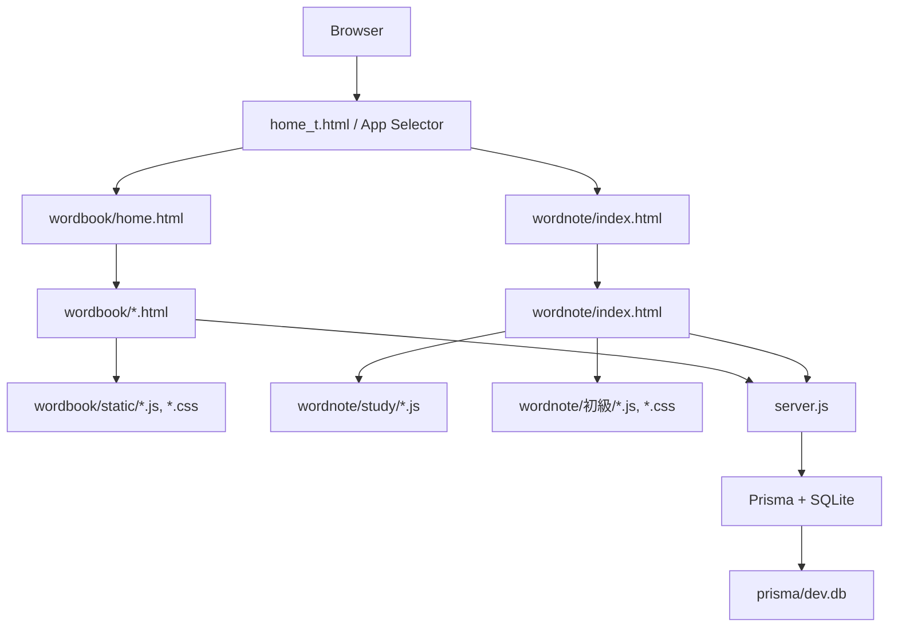

# Wordbook / Wordnote - English README

This repository contains a local learning application built with Node.js, Express, Prisma, and SQLite. The root menu at `home_t.html` lets you choose between the Wordbook and Wordnote apps.

## Architecture



### What this means

- `home_t.html` is the top-level launcher page.
- `wordbook/` contains the flashcard workflow for folders, review scheduling, and CSV import/export.
- `wordnote/` contains the wordbook-style study screens, including study modes and the 初級 pages.
- `server.js` serves the static files and provides the REST API.
- Prisma stores data in `prisma/dev.db`.

## Installation

### Requirements

- Node.js 18.18 or later
- npm
- Windows PowerShell 5.1+ recommended

### Steps

1. Move to the project root.

```powershell
cd wordnote
```

If you are already inside the repository root, you can skip this step.

2. Install dependencies.

```powershell
npm install
```

3. Generate the Prisma client and initialize the database.

```powershell
npx prisma generate
npx prisma db push
```

This creates or updates `prisma/dev.db` with the current schema.

4. Start the server.

```powershell
npm start
```

Expected output:

```text
Server listening on http://localhost:3000
```

5. Open the app in your browser.

```text
http://localhost:3000/
```

### Resetting the local database

If you want to reset the SQLite database during development:

```powershell
Remove-Item prisma/dev.db
npx prisma db push
```

## Security Considerations

This project is intended for local development and personal use. It is not hardened for public deployment.

- Add authentication and authorization before exposing it to other users.
- Use HTTPS/TLS in any deployed environment.
- Restrict CORS instead of allowing broad cross-origin access.
- Keep validating input on both client and server.
- Review file upload and CSV import paths carefully before using them with untrusted files.
- Add rate limiting and request size limits if the server is exposed to a network.
- Treat Prisma as a strong mitigation for SQL injection, but still validate all user input.
