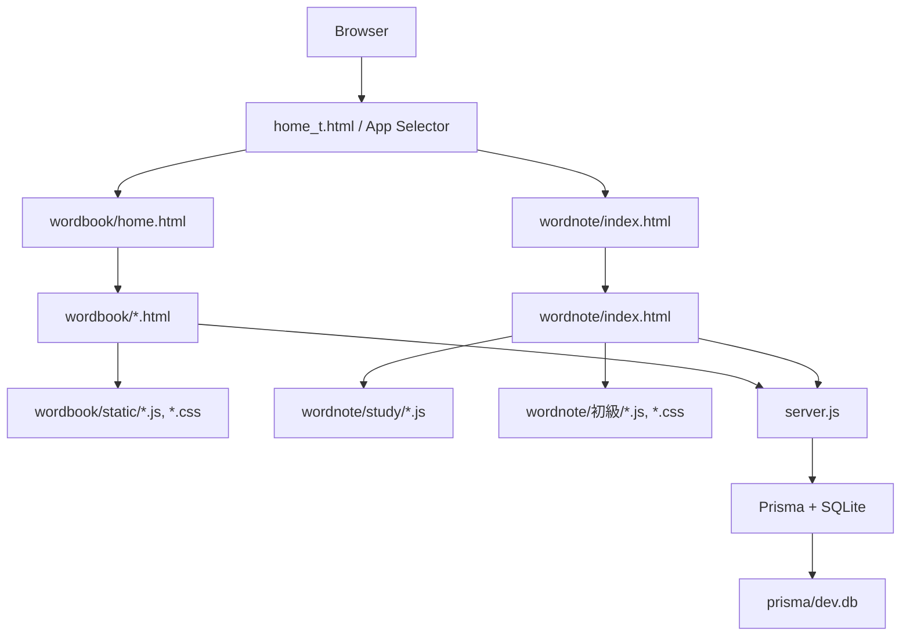

# Wordbook / Wordnote - English README

This repository contains a local learning application built with Node.js, Express, Prisma, and SQLite. The root menu at `home_t.html` lets you choose between the Wordbook and Wordnote apps.

## Features

### Wordbook

`wordbook/` is the flashcard app for managing folders, cards, review schedules, and CSV import/export.

- **Folder management** - Create, rename, delete, and browse folders, with card counts shown for each folder.
- **Card management** - Add, edit, delete, and review cards inside the selected folder.
- **Card flip view** - Click a card to switch between front and back.
- **Study modal** - Open cards in a larger modal, move between cards, and switch between front and back manually.
- **Review scheduling** - Pick a date from the calendar and automatically create review dates for 1, 3, 7, 14, and 30 days later.
- **Today’s review list** - Show the folders that are due for review today.
- **CSV export** - Download the cards in a folder as CSV.
- **CSV import** - Import folders and cards from a CSV file.

### Wordnote

`wordnote/` is the vocabulary-book app for managing books, study modes, learning progress, and the 初級 workflow.

- **Book management** - Create, rename, delete, and list word books.
- **Book settings** - Store per-book settings such as maximum size, review settings, difficulty, and progress thresholds.
- **Study modes** - Study cards by today’s due cards, difficulty level, random selection, or custom filters.
- **Common study UI** - Use audio playback, answer buttons, next-card navigation, and study history saving.
- **Initial-level workflow** - Open the 初級 screens for word display, word input, and incremental information entry.
- **Progress tracking** - Track fields such as difficulty, current level, info-plus progress, review date, and study history.
- **CSV import/export** - Export or import word-book data as CSV.

## Architecture



### What this means

- `home_t.html` is the top-level launcher page.
- `wordbook/` contains the flashcard workflow for folders, review scheduling, and CSV import/export.
- `wordnote/` contains the wordbook-style study screens, including study modes and the 初級 pages.
- `server.js` serves the static files and provides the REST API.
- Prisma stores data in `prisma/dev.db`.

## Installation

### Requirements

- Node.js 18.18 or later
- npm
- Windows PowerShell 5.1+ recommended

### Steps

1. Move to the project root.

```powershell
cd wordnote
```

If you are already inside the repository root, you can skip this step.

2. Install dependencies.

```powershell
npm install
```

3. Generate the Prisma client and initialize the database.

```powershell
npx prisma generate
npx prisma db push
```

This creates or updates `prisma/dev.db` with the current schema.

4. Start the server.

```powershell
npm start
```

Expected output:

```text
Server listening on http://localhost:3000
```

5. Open the app in your browser.

```text
http://localhost:3000/
```

### Resetting the local database

If you want to reset the SQLite database during development:

```powershell
Remove-Item prisma/dev.db
npx prisma db push
```

## Security Considerations

This project is intended for local development and personal use. It is not hardened for public deployment.

- Add authentication and authorization before exposing it to other users.
- Use HTTPS/TLS in any deployed environment.
- Restrict CORS instead of allowing broad cross-origin access.
- Keep validating input on both client and server.
- Review file upload and CSV import paths carefully before using them with untrusted files.
- Add rate limiting and request size limits if the server is exposed to a network.
- Treat Prisma as a strong mitigation for SQL injection, but still validate all user input.
